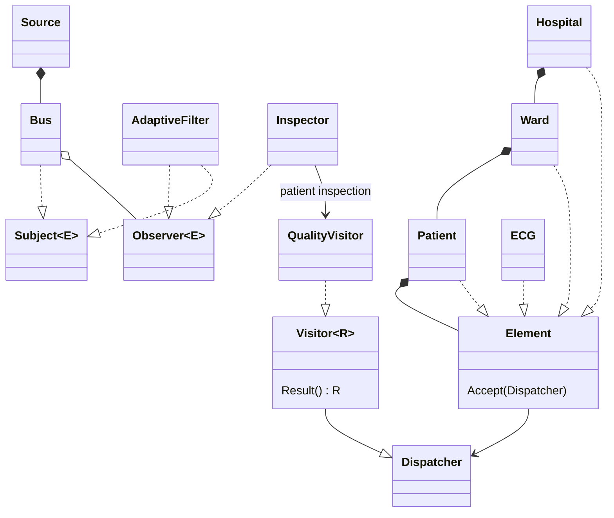

# Class diagram

```mermaid
classDiagram
    class Subject~E~
    class Observer~E~
    class Element {
        Accept(Dispatcher)
    }
    class Visitor~R~ {
        Result() R
    }
    Source *-- Bus
    Bus ..|> Subject
    Bus o-- Observer
    AdaptiveFilter ..|> Observer
    AdaptiveFilter ..|> Subject
    Inspector ..|> Observer
    Inspector --> QualityVisitor : patient inspection
    Hospital *-- Ward
    Ward *-- Patient
    Patient *-- Element
    Hospital ..|> Element
    Ward ..|> Element
    Patient ..|> Element
    ECG ..|> Element
    Element --> Dispatcher
    Visitor --|> Dispatcher
    QualityVisitor ..|> Visitor
```

The other leaves follow ECG's contract; the other visitors follow QualityVisitor's contract.
